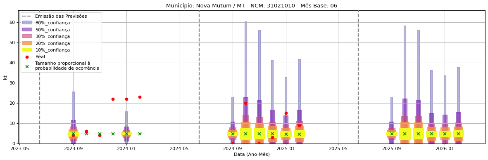
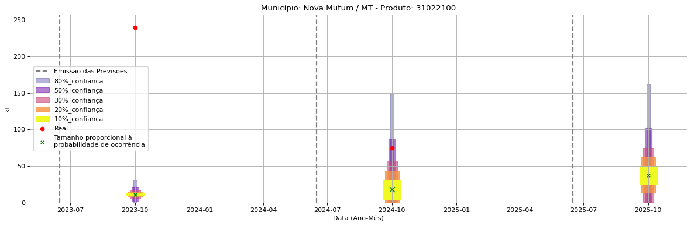
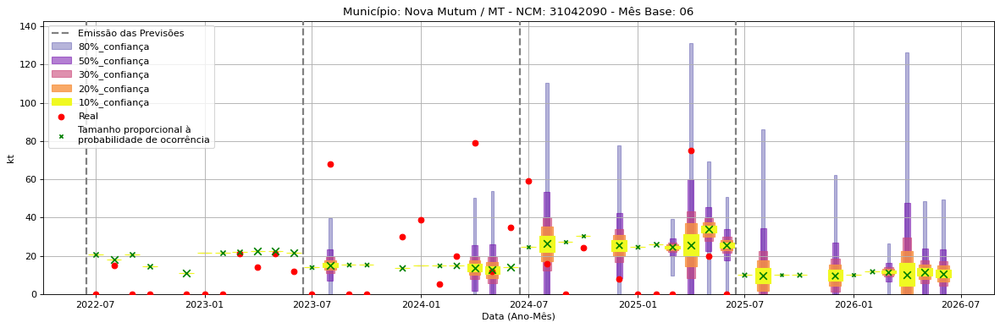

<header>
    <h1><a href="https://quantimportbrazil.github.io/Sobre/">QuantImport</a></h1>
</header>

---

# Previsão de Importação - Nova Mutum-MT

> **Emissão:** 06-2025
> Para fins de comparação, também apresentamos a seguir previsões e valores reais de períodos anteriores ao atual.
> As previsões foram geradas com base em dados limitados até o mês 6.

---

**[Home](https://quantimportbrazil.github.io/Sobre/)** | **[Selecionar Estado (UF)](https://quantimportbrazil.github.io/Unidades_Federativas/)**

Fator de Influência em Destaque nos últimos 8 anos:

Previsão Influenciada:
- Município: Nova Mutum
- Produto (NCM): Ureia, mesmo em solução aquosa, com teor de nitrogênio (azoto) superior a 45 %, em peso, calculado sobre o produto anidro no estado seco-31021010 
- Mês previsto: 01

Fator Influenciador: Comércio Exterior
- Produto Combustíveis minerais, óleos minerais e produtos da sua destilação; matérias betuminosas; ceras minerais (27)
- UF PE
- Unidade kt_mun
\n

Fator de Influência em Destaque nos últimos 8 anos:

Previsão Influenciada:
- Município: Nova Mutum
- Produto (NCM): Sulfato de amônio-31022100 
- Mês previsto: 12

Fator Influenciador: Comércio Exterior
- Produto Adubos (fertilizantes) (31)
- UF MG
- Unidade kt_lag1
\n

Fator de Influência em Destaque nos últimos 8 anos:

Previsão Influenciada:
- Município: Nova Mutum
- Produto (NCM): Outros cloretos de potássio-31042090 
- Mês previsto: 07

Fator Influenciador: Comércio Exterior
- Produto Adubos (fertilizantes) (31)
- UF BA
- Unidade kt_lag12
\n

